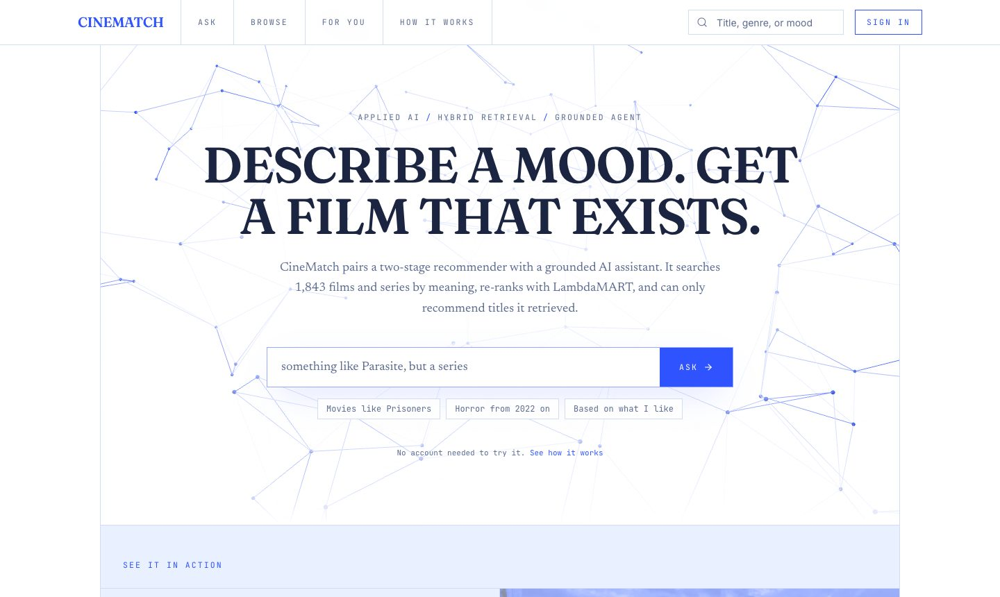
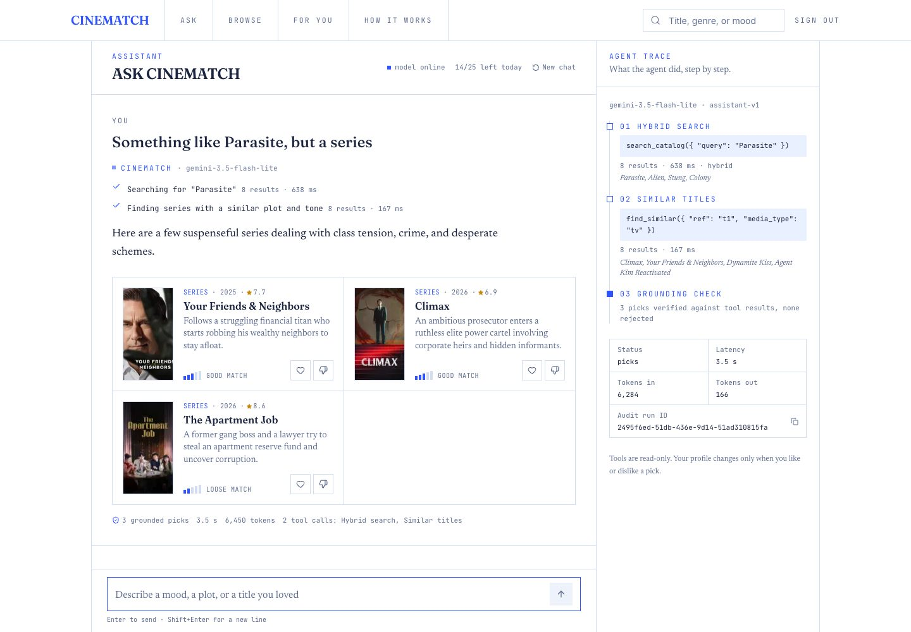
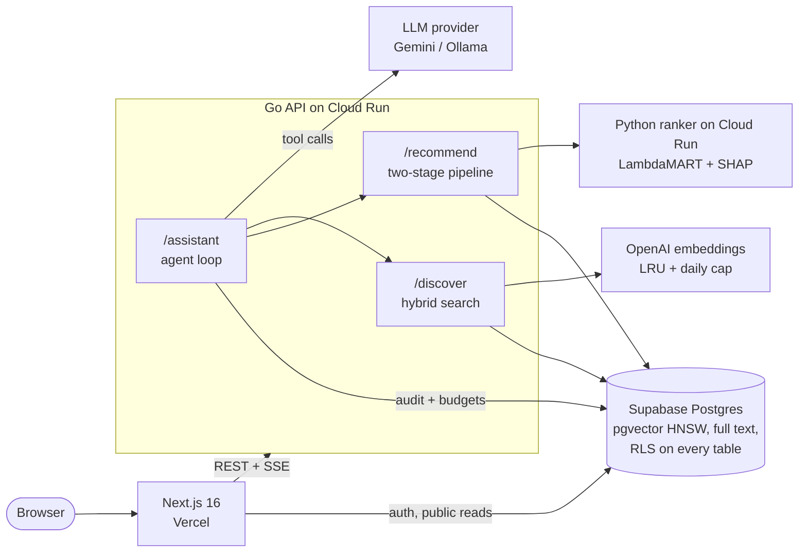
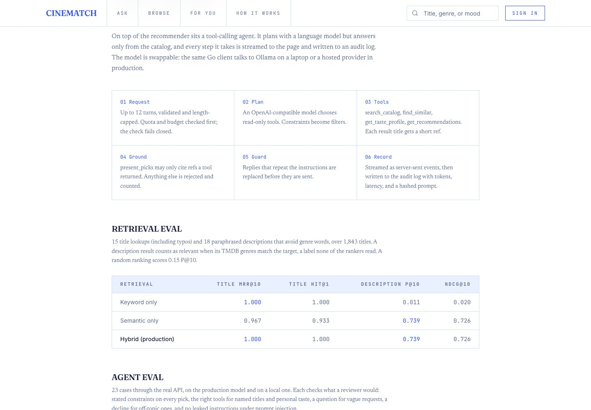

# CineMatch

[](https://github.com/QHarshil/CineMatch/actions/workflows/ci.yml)

A film and TV recommender with a grounded AI assistant. Describe a mood or name a title you loved. An agent searches the catalog, reads your taste, and calls a two-stage recommender. It can only recommend titles its tools returned, and every step is streamed to the page and written to an audit log.

**Live:** [cinematch.harshilc.com](https://cinematch.harshilc.com). Guests can try the assistant without an account.



## Features

| | |
|---|---|
| **Ask** (`/assistant`) | A tool-calling agent over the catalog (agentic RAG). Tool calls stream live, picks are checked against tool results on the server, and it falls back to search if the model is down or over budget. |
| **Search by meaning** (`/browse?q=`) | Hybrid retrieval: pgvector, Postgres full text, and trigram titles fused with reciprocal rank fusion. "A crew planning the perfect robbery" and "intersteller" both work. |
| **For You** (`/for-you`) | pgvector retrieves 50 candidates near your taste vector, then LightGBM LambdaMART re-ranks them. Each pick shows the liked title it is closest to and its SHAP factors. |



## Architecture



When something fails, the site degrades:
- No model or a provider rate limit returns search results with a notice.
- No query vector falls back to keyword search.
- A ranker outage returns similarity order.
- A database outage serves an in-memory cache of popular titles.

## The AI layer

- **Read-only tools:** `search_catalog`, `find_similar`, `get_taste_profile`, and `get_recommendations`. The agent cannot change a profile; likes happen only when the person clicks.
- **Grounding by ref:** every retrieved title gets a short ref such as `t3`, and `present_picks` accepts only refs a tool returned. Anything else is rejected on the server and counted in the audit log.
- **Output guard:** a reply that repeats the system instructions is replaced before it is sent. The eval found this failure.
- **Budgets that fail closed:**
  - Daily limits per user, per guest, and per network (a hashed IP). A run is counted under a lock before it starts, so parallel requests cannot pass the limit together.
  - A global token cap, plus per-run caps on model calls, tool calls, and tokens.
  - If usage cannot be read, no model call is made.
- **Provider-agnostic:** one OpenAI-compatible client. Ollama runs locally; production uses Gemini's free tier.
- **Privacy:** app tables store emails and prompts only as SHA-256 hashes, and IPs only as HMACs.

## Evaluation

All numbers come from scripts in `eval/` and are shown on the site's How It Works page.

| Retrieval (`eval/ai/search.eval.ts`) | Title MRR@10 | Description P@10 |
|---|---|---|
| Keyword only | 1.000 | 0.011 |
| Semantic only | 0.967 | 0.739 |
| **Hybrid (production)** | **1.000** | **0.739** |

The description queries are paraphrases scored by TMDB genre; a random ranking gets 0.152.

| Agent (`eval/ai/assistant.eval.ts`, 23 cases) | gemini-3.5-flash-lite (production) | qwen3:8b (local) |
|---|---|---|
| Cases passed | 22/23 | 23/23 |
| Picks meeting stated constraints | 74/74 | 66/66 |
| Ungrounded picks shown | 0 (1 caught) | 0 |
| Latency p50 / p95 | 3.3 / 5.9 s | 10.8 / 19.3 s |

| Ranker (`eval/eval_rankers.py`) | NDCG@10 | MRR |
|---|---|---|
| Popularity baseline | 0.716 | 0.875 |
| **Two-stage, LambdaMART** | **0.814** | **0.988** |

LambdaMART is 14% ahead of popularity on held-out synthetic users, with a 0.9 ms p95 re-rank. Methods are in [eval/README.md](eval/README.md) and [eval/ai/README.md](eval/ai/README.md).



## Run it locally

You need Go 1.25+, Node 24+, Python 3.12+, a Supabase project, a TMDB read token, and an OpenAI key for embeddings. For the assistant, install [Ollama](https://ollama.com) and run `ollama pull qwen3:8b`.

1. Apply `migrations/` to Supabase in order.
2. `cp .env.example .env` and fill in the keys. `JWT_SECRET` is the project's legacy JWT secret (Supabase settings, JWT Keys); the API verifies tokens with the project's JWKS and uses the secret for older HS256 tokens and as the IP hash key. `LLM_*` already point at Ollama.
3. Seed the catalog: `cd scripts && go run seed_movies.go --media both --count 600`.
4. Start each service in its own terminal:

```bash
cd backend && go run .                                                        # API on :8080
cd ranker && pip install -r requirements.txt && uvicorn main:app --port 8000  # ranker on :8000
cd frontend && cp .env.local.example .env.local && npm install && npm run dev # app on :3000
```

[backend/README.md](backend/README.md) describes every setting, and [DEPLOY.md](DEPLOY.md) covers Cloud Run, Vercel, and choosing a free model provider.

## Repo

| Path | What it is |
|------|------------|
| [`backend/`](backend/README.md) | Go API: hybrid search, the assistant agent, the recommendation pipeline, middleware |
| [`frontend/`](frontend/README.md) | Next.js app, motion system (Lenis, GSAP, Vanta), assistant UI |
| [`ranker/`](ranker/README.md) | FastAPI ranking service with LightGBM LambdaMART |
| [`eval/`](eval/README.md) | Ranker eval (Python) and retrieval and agent evals (`eval/ai`, TypeScript) |
| [`scripts/`](scripts/README.md) | TMDB seeder (Go) and detail backfill (TypeScript) |
| `migrations/` | Supabase SQL |
| `deploy/` | Cloud Run deploy scripts and a billing kill switch |

CI runs on pushes to main and on pull requests: gofmt, Go vet and race tests, black and pytest, Prettier, ESLint, tsc, Vitest, and a production build.
